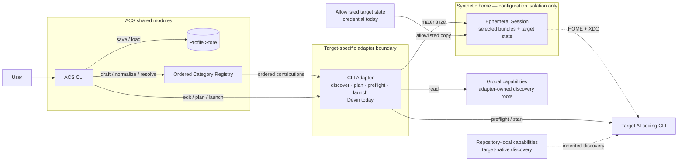
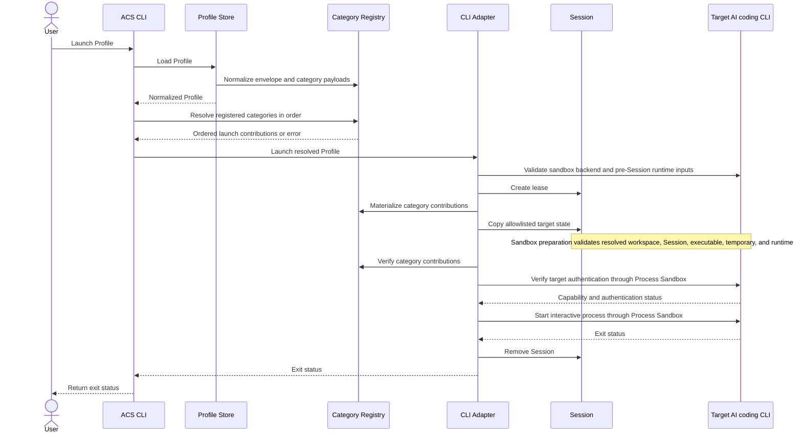

# Architecture

AI Config Selector (ACS) creates named Profiles of capabilities and applies
them when it launches a supported AI coding CLI. Each CLI Adapter translates a
Profile into target-specific discovery paths, runtime configuration, preflight
checks, and launch behavior.

## Product model

A Profile belongs to one target CLI. It records the user's capability choices
through stable references and leaves target-specific discovery and runtime
rules to a CLI Adapter. Shared modules own Profile persistence, ordered
category coordination, Session lifecycle, and the interactive process
contract. Each registered category owns its reference resolution and launch
contribution.

The current vertical slice implements Skills as the first capability type and
Devin as the first CLI Adapter. The product boundary permits additional
capability types and CLI Adapters.

## Implemented scope

The current source-built implementation supports:

- macOS 26 and Ubuntu 24.04 LTS on amd64 and arm64;
- one CLI Adapter, for Devin;
- user-global Skills discovered from Devin and shared-agent locations;
- named Profiles stored on the local machine;
- interactive Profile creation;
- dry-run inspection;
- interactive Devin launches through an ephemeral Session.

The current Profile schema does not represent MCP servers, hooks, instructions,
agents, or arbitrary target settings. The Devin Adapter leaves
repository-local Skills under Devin's control.

The public `acs version` command reports `acs vMAJOR.MINOR.PATCH` when Go build
metadata identifies a canonical tagged module release or the pinned Release
Builder supplies the canonical tag. Version selection stays in application
assembly and has no maintained version constant. Local, dirty, pseudo-version,
and missing or unusable metadata report `acs devel`.

Release-candidate tooling is a repository validation boundary, not an ACS
runtime mode. It builds and verifies distribution archives and renders and
tests the pinned installer without changing Profile, Adapter, Session, or CLI
runtime contracts.

The distribution model uses two exact terms. A **Supported Platform** is an
operating-system family and version: macOS 26 or Ubuntu 24.04 LTS for v0.2.0. A
**Supported Release Target** is a supported operating-system and architecture
pair: `darwin/arm64`, `darwin/amd64`, `linux/amd64`, or `linux/arm64`. The
downloadable binary for one of those targets is a Supported Release binary only
after the complete release checklist and immutable publication gates pass.
Source-built binaries are development inputs, not substitutes for native
promoted-artifact evidence; a local build reports `acs devel`.

## Core concepts

**Profile**: A named, machine-local selection for one target CLI. A Profile
stores Skill References rather than copies of Skills.

**Skill Reference**: The stable identity of a selected global Skill Bundle. It
combines an adapter-owned source with a bundle-relative path, such as
`devin-config:code-review`.

**Skill Bundle**: A selectable Skill directory, including its `SKILL.md` and
any relative scripts, references, or assets.

**Skill Catalog**: The global Skill Bundles ACS can discover at a point in
time. The catalog can contain the same display name from different sources.

**CLI Adapter**: The target-specific boundary that discovers capabilities,
builds a launch plan, prepares target state, verifies compatibility, and starts
the target CLI.

**Category Registry**: The adapter-owned, fixed ordering of supported Profile
Component Categories. It constructs typed drafts, normalizes saved category
payloads, resolves saved selections, and runs category contributions in order.

**Profile Draft**: The typed, unsaved selections for every registered category.
The Registry encodes every draft category, including empty selections, into a
Profile.

**Session**: An ephemeral launch environment under
`~/.acs/sessions/session-*`. It contains a synthetic home, selected Skill
Bundles, and the target state needed for the child process. The current Devin
Adapter adds an allowlisted Devin credential.

**Supported Install Path**: Download the release-specific `install.sh`, inspect
the file, then execute that local copy. It defaults to `~/.local/bin`, accepts
only `--bin-dir` for a custom user-writable absolute destination, verifies the
selected archive with the release's `SHA256SUMS`, validates exact version and
archive structure, and publishes the executable atomically. It never pipes
network content directly into a shell, uses `sudo`, edits shell startup files,
or supplies package-manager, automatic-update, or uninstaller behavior.

## Module boundaries

| Module | Responsibility |
| --- | --- |
| `cmd/acs` | Identifies the host, enforces the certified platform matrix, resolves host paths, and assembles the application. |
| `internal/cli` | Parses public commands and coordinates Profile creation, dry runs, and launches through narrow interfaces. |
| `internal/profile` | Validates Profile names and owns local JSON persistence. |
| `internal/category` | Binds typed category modules and owns ordered draft, schema, resolution, and launch-contribution coordination. |
| `internal/skills` | Defines Skill Catalog types and resolves strict Skill References. |
| `internal/adapter/devin` | Encapsulates Devin discovery paths, Session layout, preflight checks, launch planning, and process supervision. |
| `internal/launch` | Owns Session leases, certified-platform checks, the shared Process Sandbox boundary, and CLI-neutral launch and terminal types. |



The CLI layer depends on the ordered Category Registry, storage, draft editing,
planning, and launch interfaces. It does not import Skills types or switch on
category IDs. A CLI Adapter assembles its fixed Registry and implements
target-specific editing and process behavior. Profile storage delegates schema
normalization to that Registry and does not depend on target paths.
The Session boundary in the diagram represents configuration isolation. The
separate Process Sandbox boundary prepares every target process and owns native
backend selection and containment policy.

## Profile lifecycle

ACS creates a Profile through this sequence:

1. validate the Profile name;
2. create a typed draft containing every registered category's empty selection;
3. delegate category editing to the CLI Adapter;
4. ask the Registry to encode every category into a versioned Profile;
5. persist the Profile.

Profiles live at `~/.acs/profiles/<name>.json`. ACS restricts the profiles
directory to the user (`0700`) and each Profile file to the user (`0600`). It
writes and syncs a temporary file in the profiles directory, then publishes it
without replacing an existing Profile name.

Before a dry run or launch, the Profile Store delegates envelope migration,
category defaults, schema dispatch, validation, and canonical encoding to the
Registry. The Registry then resolves each category in its fixed order. The
Skills category discovers a new Skill Catalog and requires each saved Skill
Reference to match exactly one current bundle. Missing and ambiguous references
fail instead of binding to a different Skill.

## Dry-run lifecycle

A dry run resolves the Profile and applies each category's declarative plan
contribution in Registry order. Shared CLI code renders the resulting generic
sections. The current Skills contribution reports:

- selected global Skill Bundles and their planned Session paths;
- repository-local Skill Bundles that Devin may inherit.

A dry run does not create a Session or start Devin.

## Launch lifecycle



The current Devin Adapter creates a synthetic home, copies each selected Skill
Bundle into its Devin discovery location, and copies the existing Devin
credential when present. It points `HOME` and the XDG configuration, data,
cache, and state variables at the synthetic home before preflight and launch.
The interactive process inherits the invoking terminal. ACS preserves signals,
resize events, and the child exit status.

Session leases let concurrent launches coexist. A later launch removes an
abandoned Session only when no process holds its lease.

## Implemented adapter: Devin

The adapter discovers user-global Skill Bundles from:

```text
$HOME/.config/devin/skills/
$HOME/.agents/skills/
```

It recognizes repository-local Skill Bundles under:

```text
<repository>/.devin/skills/
<repository>/.agents/skills/
```

ACS manages the global sources. Devin may inherit the repository-local sources,
so the dry run reports them separately.

The adapter copies only this existing Devin state into a Session:

```text
$HOME/.local/share/devin/credentials.toml
```

It does not copy the surrounding Devin configuration, MCP configuration, hooks,
rules, or unselected global Skills.

Before the interactive process starts, the adapter runs two probes inside the
Session environment:

1. `devin skills list --json` must report exactly the selected managed global
   Skill Bundles after built-in and repository-local Skills are excluded;
2. `devin auth status` must report a usable existing login.

Command failures, incompatible output, unmanaged global sources, catalog
mismatches, and unavailable authentication abort the launch. Preflight errors
expose capability-level diagnostics without returning subprocess output,
credentials, environment values, or account details.

### Optional authenticated smoke

The required release gate stays credential-free: one candidate artifact set is
installed and exercised natively on darwin/arm64, darwin/amd64, linux/amd64,
and linux/arm64. The native matrix declares the sandbox backend capability
expected at each increment. The Ubuntu rows require the Bubblewrap launch and
lifecycle contract; before their native tests, they install the targeted
`bwrap-userns-restrict` AppArmor profile for `/usr/bin/bwrap` from a pinned,
SHA-256-verified AppArmor upstream release and execute a real Bubblewrap
user-namespace probe. This preserves Ubuntu's global unprivileged-user-namespace
restriction while authorizing only the required Bubblewrap executable. The
macOS rows return the stable `backend_unavailable` category without starting the
target or leasing a Session until #57 adds Seatbelt. A real-Devin smoke is an
optional maintainer check for changes that affect authentication,
the Devin Adapter, Profile selection, Session isolation, or interactive
lifecycle behavior. It runs only on an authorized macOS 26 arm64 maintainer
host and never places personal credentials in CI or a release artifact.

### Immutable release publication

An annotated canonical SemVer tag is the release authorization boundary. The
tag points to the exact source commit and has a nonempty human-readable
annotation. Version-controlled release notes are a separate required input.
The workflow rejects lightweight or moved tags, source mismatches, dirty
source, and missing release notes.

One Linux job builds the complete six-file Release Artifact Set. Four native
jobs download that one workflow artifact and validate the supplied bytes; none
rebuilds them. After every native job passes, provenance attestation covers the
four archives and checksum manifest. Attestation alone receives
`id-token: write` and `attestations: write`. A repository-only policy App is
scoped through the `release` environment and receives Administration(write),
which is required for GitHub to return ruleset bypass actors. The publication
job separately receives a job-scoped `GITHUB_TOKEN` with Contents(write); all
other workflow jobs remain read-only. No token can both inspect or alter policy
and publish a Release. The environment has no required reviewers: the sole
maintainer's exact annotated tag push is the human release authorization, and
the environment only scopes the policy credential.

Publication is a forward-only state machine: create a draft, resume a
compatible partial draft by uploading only missing exact assets, publish a
complete draft once, or accept an already immutable exact match. Conflicting
metadata, source, asset names, sizes, digests, prerelease state, or mutable
public state stops publication. The workflow also fails closed unless the
repository immutable Releases setting is enabled, one active non-bypassable tag
ruleset restricts updates and deletions for `refs/tags/v*`, and a separate
active ruleset restricts tag creation to one explicitly identified release
maintainer who must also be the tag-triggering actor. A local preparation
command requires clean fetched `main`, validates the candidate, creates the
annotated tag without pushing it, and reports the exact tag object for approval.
The workflow verifies the live annotated tag object, peeled source commit, and
containment in protected `main` before draft creation and again before
publication. It never deletes or replaces a tag, Release, or asset, so
correction requires a new patch version.

The six-file Release Artifact Set is the four target archives, `SHA256SUMS`,
and the release-specific `install.sh`. The build-provenance step covers the
four archives and checksum manifest; the downloaded installer is instead
reviewed before execution. SHA-256 verification, build provenance, and the
immutable Release attestation are complementary evidence. None provides source
safety, malware absence, Apple Developer ID identity, notarization, Apple
malware review, or Gatekeeper trust.

v0.2.0 macOS binaries are unsigned and unnotarized. Gatekeeper behavior can
vary with quarantine provenance, prior user decisions, host policy, and device
management. The supported flow never disables Gatekeeper or removes quarantine;
any permitted trust decision remains explicit and user-controlled.

## Isolation boundaries

The synthetic home isolates Devin's normal configuration discovery from the
user's global Skill directories. ACS copies only selected global Skill Bundles
and the allowlisted credential into that home.

The shared Process Sandbox boundary owns certified-host validation, native
backend selection, path resolution, environment filtering, descriptor rules,
and process-group preparation. Every Devin capability probe and interactive
launch uses that boundary. ACS fails closed before leasing a Session when the
host, executable, workspace, runtime inputs, or required native backend cannot
be validated; a later preparation failure removes the unused Session.

The shared layer passes only Session-scoped HOME, XDG, and temporary paths, a
fixed safe PATH, and validated terminal and locale values. It has no public
backend selector, policy input, environment passthrough, or sandbox bypass.
It also classifies process-start and non-exit wait failures at the boundary so
backend output, generated policy, host paths, and environment values do not
enter CLI diagnostics; ordinary child exit status remains intact.
On certified Ubuntu 24.04 targets, the production backend requires the
root-owned, non-group/world-writable regular `/usr/bin/bwrap` executable. The
installed binary and source package must both be `bubblewrap`, its dpkg
architecture must match the certified ACS runtime, and `dpkg --verify` must
report no packaged-checksum differences before the backend proves
user-namespace capability and leases a Session. This is an offline check
against root-controlled dpkg state; it does not defend against an administrator
who can replace both the executable and that state. The backend constructs an
empty-root mount namespace with writable workspace and Session mounts,
read-only named runtime inputs and system runtime, Session-local temporary
storage, and no host-home or host-socket mounts. IPC, PID, UTS, cgroup, and user
namespaces contain descendants while the host IP network namespace preserves ordinary
outbound networking. The backend clears the environment before applying the
shared allowlist, and the target inherits only the three shared terminal
descriptors. Bubblewrap setup temporarily inherits two private pipe
descriptors for the child-identity and user-namespace release handshake; ACS
closes them before the target execs.

ACS holds that release barrier until the Bubblewrap monitor and namespace
child have stable pidfd identities and user-namespace setup is complete.
Startup abort freezes the stable monitor, captures stable identities for its
blocked children, and proves those children dead before releasing the barrier;
cleanup failures retain the closed barrier under explicit quarantine ownership.
Unhandled terminating signals stop the namespace target, terminate and prove
the monitor exited without reaping its requested-signal status, and then kill
the target fail-closed. Bubblewrap and the kernel user namespace jointly
contain the process tree and propagate target exit and cancellation behavior
to the caller. Missing,
modified, unpackaged, or incapable Bubblewrap installations fail closed with
fixed package-remediation guidance. Seatbelt remains separate backend work;
until it is present, macOS launch fails closed rather than running Devin
without containment.

Repository-local Skills remain visible because Devin runs in the selected
repository. ACS reports them but does not filter, copy, or manage them.

## Invariants

- ACS never modifies the user's global Skill directories when creating or
  launching a Profile.
- A Skill Reference never silently rebinds after a bundle moves or disappears.
- ACS materializes the complete selected Skill Bundle.
- Adapter preflight fails closed when ACS cannot verify the selected global
  catalog and usable authentication.
- Dry-run output distinguishes ACS-managed global Skills from inherited
  repository-local Skills.
- Interactive launch preserves the invoking terminal and the target CLI exit
  status.
- Session cleanup does not remove a Session held by a concurrent process.

## Accepted design: modular interactive Profile creation

**Status:** Implemented. New Profiles use the version-2 category envelope, the
ordered Category Registry coordinates the full Profile lifecycle, and ACS
normalizes version-1 Profiles in memory. Profile creation opens a Bubble Tea
builder with a category overview, searchable Skills selection, lazy discovery,
empty and failed-discovery confirmation, recoverable saving, changed-draft
cancellation, minimum-size handling, contextual controls, and TTY validation.

The interactive builder keeps `acs devin create-profile --name <name>` as its
public command. It validates the name, rejects an existing Profile name, and
requires interactive stdin and stdout before opening the TUI. The interface
uses English text and keyboard input.

### Product concepts

**Profile Component Category**: A target-supported kind of selectable Profile
content. Skills is the first category. Each category has its own catalog,
editor, selection schema, saved-selection resolution, and launch contribution.

**Profile Draft**: The unsaved category selections and editor state assembled
during Profile creation. Moving between categories preserves the draft.
Creating the Profile persists it; cancellation discards it.

Each CLI Adapter provides a fixed, ordered set of supported categories.
Categories are compiled into ACS. Loading third-party category plugins is
outside this design.

### Interaction contract

The builder overview shows every supported category, its selection count,
and the `Create Profile` and `Cancel` actions:

```text
Create Profile "backend-review"

> Skills                         2 selected
  Create Profile
  Cancel

Up/Down navigate  Space/Enter/Right open
Esc cancel  Ctrl+C cancel
```

`Space`, `Enter`, or Right opens a category. Left or `Esc` returns to the
overview when the category list has focus. Each category may provide a
different editor.

The Skills editor uses a searchable multi-select list:

```text
Skills                         2 selected
Search: post

> [x] postgres-review [shared-agents]
  [ ] postgres-docs [devin-config]

Source: shared-agents
Path: /Users/example/.agents/skills/postgres-review

Up/Down navigate  Space/Enter toggle  / search
Left/Esc back  Ctrl+C cancel
```

The highlighted Skill shows its source and full path in a detail area. Search
is fuzzy and case-insensitive across display name, source, and path, with
display-name matches ranked first. Filtering does not clear hidden selections.
Without a query, Skills sort case-insensitively by display name, then by source
and relative path. The saved Skills selection sorts by
stable identity because selection order has no meaning.

The builder applies these rules:

- `/` focuses search. Left and Right edit the query while search has focus.
  `Esc` clears search and returns focus to the list.
- Category query, cursor, scroll position, and selection remain in the Profile
  Draft when the user returns to the overview.
- A contextual footer lists valid keys. Symbols and text convey every state;
  color only reinforces them and respects `NO_COLOR`.
- A terminal smaller than 64 columns by 18 rows shows a resize message and
  keeps the complete draft and active screen for restoration after resizing.
- Catalog discovery starts when the user first opens a category. A load error
  offers `Retry` and `Back`.
- Creating an empty Profile requires confirmation. If a category load failed,
  creation requires another confirmation that names the failed categories.
- `Cancel`, overview `Esc`, and `Ctrl+C` share the discard flow. A changed draft
  requires confirmation. Confirmed cancellation writes nothing, prints
  `Profile creation cancelled.`, and exits with status 130.
- Saving runs asynchronously after `Create Profile`. The root model enters a
  saving state with an immutable draft snapshot. Success exits the TUI;
  failure keeps the draft and offers `Retry` or `Cancel`.
- After success restores the terminal, ACS prints the Profile name, category
  selection counts, and saved path.

Mouse input, a non-TTY fallback, interactive Profile-name entry, and Select All
remain outside this change.

### Implemented version-2 Profile schema

New Profiles store one versioned payload for every supported category,
including empty selections:

```json
{
  "version": 2,
  "name": "backend-review",
  "target": "devin",
  "categories": {
    "skills": {
      "schemaVersion": 1,
      "selection": [
        {
          "source": "devin-config",
          "relativePath": "code-review"
        }
      ]
    }
  }
}
```

The Profile version covers the envelope. Each category owns its stable ID,
category schema version, validation, and deterministic `selection` encoding.
An older Profile that lacks a newly supported category receives that
category's empty selection, so an ACS upgrade does not enable capabilities.

ACS reads version-1 Profiles by normalizing `skillReferences` to a
version-2-shaped Skills payload in memory. It does not rewrite the source file.
New creation writes version 2. Unknown category IDs, unsupported category
schema versions, malformed selections, and unresolved references fail with a
clear error.

### Category module seam

An ordered category Registry forms the interface used by common CLI code. The
Registry hides category defaults, schema dispatch, draft construction,
saved-selection resolution, error annotation, and launch contribution order.
The CLI does not switch on category IDs or import Skills types.

Generic binders keep each category's selection and resolved values typed
inside its implementation. Skills bind `[]SkillReference` to
`[]SkillBundle`. A test-only category uses unrelated selection, editor, and
launch types. Registering that category does not require changes to the
Profile store, builder shell, Registry, or launch coordinator.

Each production category owns its target-specific lifecycle:

1. discover its catalog;
2. edit and summarize its selection;
3. validate and encode its payload;
4. resolve saved intent against the current target environment;
5. contribute declarative dry-run, materialization, and verification steps to
   the launch plan.

The TUI keeps a separate visual editor Registry. Each visual registration is
bound to the opaque typed registration for the same stable category ID and
owns that category's editor factory and concrete discovery-result adapter.
This isolates Bubble Tea types from Profile, category, and launch interfaces
while allowing each category to use a different editor. Adapter assembly
orders editors by the domain Registry and rejects missing, duplicate,
mismatched, or type-incompatible editors before command execution.

### TUI runtime and verification

The builder uses Bubble Tea v2 as its terminal runtime and selected Bubbles
v2 packages for list, filtering, text input, viewport, and contextual help.
ACS owns the set of selected Skill identities instead of treating list
indexes or fuzzy ranks as identity.

One root Bubble Tea model owns the alternate screen, terminal dimensions,
overview, Profile Draft, modal state, independent per-category editor and load
state, saving state, and exit outcome. Category editors are retained child
models. ACS does not start nested Bubble Tea programs.

Most tests drive pure model and Registry transitions. A smaller runtime suite
injects input, output, and fixed window dimensions. A Darwin and Linux PTY
subprocess suite covers resize, `Ctrl+C`, alternate-screen exit, panic and error
cleanup, and restored canonical terminal mode. A synthetic catalog of 10,000
Skills guards fuzzy search and navigation responsiveness.

## Current limitations

- ACS accepts only macOS 26 and Ubuntu 24.04 LTS on amd64 or arm64, and rejects
  unidentified hosts and missing native sandbox backends. Ubuntu launches use
  the verified system Bubblewrap package; macOS launches remain unavailable.
- ACS ships only the Devin Adapter.
- The Devin Registry currently contains only the Skills category.
- Profile creation uses the hardened Bubble Tea builder with search, lazy
  category discovery, recoverable saving, changed-draft cancellation,
  minimum-size recovery, and contextual controls.
- Profiles cannot be edited, deleted, imported, or exported through the CLI.
- ACS does not filter repository-local Skills.
- On Ubuntu, Bubblewrap provides filesystem and process isolation, while
  outbound networking remains allowed and ACS does not filter that traffic.
