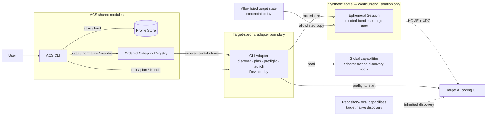
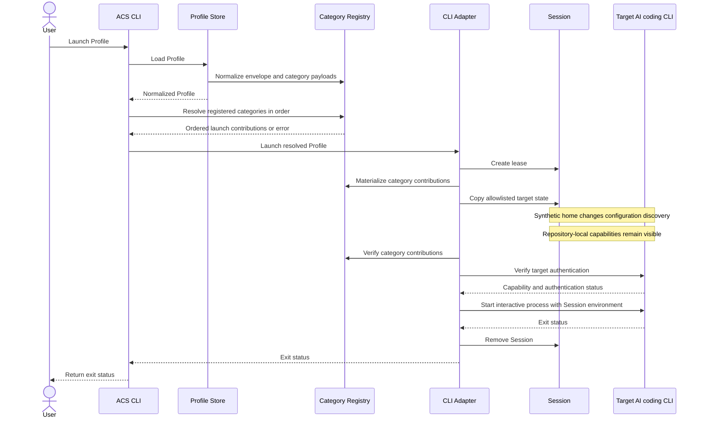

# Architecture

AI Config Selector (ACS) creates named Profiles of capabilities and applies
them when it launches a supported AI coding CLI. Each CLI Adapter translates a
Profile into target-specific discovery paths, runtime configuration, preflight
checks, and launch behavior.

## Product model

A Profile belongs to one target CLI. It records the user's capability choices
through stable references and leaves target-specific discovery and runtime
rules to a CLI Adapter. Shared modules own Profile persistence, ordered
category coordination, Session lifecycle, and the interactive process
contract. Each registered category owns its reference resolution and launch
contribution.

The current vertical slice implements Skills as the first capability type and
Devin as the first CLI Adapter. The product boundary permits additional
capability types and CLI Adapters.

## Implemented scope

The current implementation supports:

- macOS;
- one CLI Adapter, for Devin;
- user-global Skills discovered from Devin and shared-agent locations;
- named Profiles stored on the local machine;
- interactive Profile creation;
- dry-run inspection;
- interactive Devin launches through an ephemeral Session.

The current Profile schema does not represent MCP servers, hooks, instructions,
agents, or arbitrary target settings. The Devin Adapter leaves
repository-local Skills under Devin's control.

## Core concepts

**Profile**: A named, machine-local selection for one target CLI. A Profile
stores Skill References rather than copies of Skills.

**Skill Reference**: The stable identity of a selected global Skill Bundle. It
combines an adapter-owned source with a bundle-relative path, such as
`devin-config:code-review`.

**Skill Bundle**: A selectable Skill directory, including its `SKILL.md` and
any relative scripts, references, or assets.

**Skill Catalog**: The global Skill Bundles ACS can discover at a point in
time. The catalog can contain the same display name from different sources.

**CLI Adapter**: The target-specific boundary that discovers capabilities,
builds a launch plan, prepares target state, verifies compatibility, and starts
the target CLI.

**Category Registry**: The adapter-owned, fixed ordering of supported Profile
Component Categories. It constructs typed drafts, normalizes saved category
payloads, resolves saved selections, and runs category contributions in order.

**Profile Draft**: The typed, unsaved selections for every registered category.
The Registry encodes every draft category, including empty selections, into a
Profile.

**Session**: An ephemeral launch environment under
`~/.acs/sessions/session-*`. It contains a synthetic home, selected Skill
Bundles, and the target state needed for the child process. The current Devin
Adapter adds an allowlisted Devin credential.

## Module boundaries

| Module | Responsibility |
| --- | --- |
| `cmd/acs` | Enforces platform support, resolves host paths, and assembles the application. |
| `internal/cli` | Parses public commands and coordinates Profile creation, dry runs, and launches through narrow interfaces. |
| `internal/profile` | Validates Profile names and owns local JSON persistence. |
| `internal/category` | Binds typed category modules and owns ordered draft, schema, resolution, and launch-contribution coordination. |
| `internal/skills` | Defines Skill Catalog types and resolves strict Skill References. |
| `internal/adapter/devin` | Encapsulates Devin discovery paths, Session layout, preflight checks, launch planning, and process supervision. |
| `internal/launch` | Owns Session leases and the CLI-neutral launch plan and terminal types. |



The CLI layer depends on the ordered Category Registry, storage, draft editing,
planning, and launch interfaces. It does not import Skills types or switch on
category IDs. A CLI Adapter assembles its fixed Registry and implements
target-specific editing and process behavior. Profile storage delegates schema
normalization to that Registry and does not depend on target paths.
The Session boundary in the diagram represents configuration isolation; it is
not an OS sandbox around the target process.

## Profile lifecycle

ACS creates a Profile through this sequence:

1. validate the Profile name;
2. create a typed draft containing every registered category's empty selection;
3. delegate category editing to the CLI Adapter;
4. ask the Registry to encode every category into a versioned Profile;
5. persist the Profile.

Profiles live at `~/.acs/profiles/<name>.json`. ACS restricts the profiles
directory to the user (`0700`) and each Profile file to the user (`0600`). It
writes and syncs a temporary file in the profiles directory, then publishes it
without replacing an existing Profile name.

Before a dry run or launch, the Profile Store delegates envelope migration,
category defaults, schema dispatch, validation, and canonical encoding to the
Registry. The Registry then resolves each category in its fixed order. The
Skills category discovers a new Skill Catalog and requires each saved Skill
Reference to match exactly one current bundle. Missing and ambiguous references
fail instead of binding to a different Skill.

## Dry-run lifecycle

A dry run resolves the Profile and applies each category's declarative plan
contribution in Registry order. Shared CLI code renders the resulting generic
sections. The current Skills contribution reports:

- selected global Skill Bundles and their planned Session paths;
- repository-local Skill Bundles that Devin may inherit.

A dry run does not create a Session or start Devin.

## Launch lifecycle



The current Devin Adapter creates a synthetic home, copies each selected Skill
Bundle into its Devin discovery location, and copies the existing Devin
credential when present. It points `HOME` and the XDG configuration, data,
cache, and state variables at the synthetic home before preflight and launch.
The interactive process inherits the invoking terminal. ACS preserves signals,
resize events, and the child exit status.

Session leases let concurrent launches coexist. A later launch removes an
abandoned Session only when no process holds its lease.

## Implemented adapter: Devin

The adapter discovers user-global Skill Bundles from:

```text
$HOME/.config/devin/skills/
$HOME/.agents/skills/
```

It recognizes repository-local Skill Bundles under:

```text
<repository>/.devin/skills/
<repository>/.agents/skills/
```

ACS manages the global sources. Devin may inherit the repository-local sources,
so the dry run reports them separately.

The adapter copies only this existing Devin state into a Session:

```text
$HOME/.local/share/devin/credentials.toml
```

It does not copy the surrounding Devin configuration, MCP configuration, hooks,
rules, or unselected global Skills.

Before the interactive process starts, the adapter runs two probes inside the
Session environment:

1. `devin skills list --json` must report exactly the selected managed global
   Skill Bundles after built-in and repository-local Skills are excluded;
2. `devin auth status` must report a usable existing login.

Command failures, incompatible output, unmanaged global sources, catalog
mismatches, and unavailable authentication abort the launch. Preflight errors
expose capability-level diagnostics without returning subprocess output,
credentials, environment values, or account details.

## Isolation boundaries

The synthetic home isolates Devin's normal configuration discovery from the
user's global Skill directories. ACS copies only selected global Skill Bundles
and the allowlisted credential into that home.

The current runtime does not place the Devin process inside an OS filesystem
sandbox. A process that knows an absolute host path may still read it. ACS also
preserves Devin's normal network access. The Session provides configuration
isolation, not containment for hostile code.

Repository-local Skills remain visible because Devin runs in the selected
repository. ACS reports them but does not filter, copy, or manage them.

## Invariants

- ACS never modifies the user's global Skill directories when creating or
  launching a Profile.
- A Skill Reference never silently rebinds after a bundle moves or disappears.
- ACS materializes the complete selected Skill Bundle.
- Adapter preflight fails closed when ACS cannot verify the selected global
  catalog and usable authentication.
- Dry-run output distinguishes ACS-managed global Skills from inherited
  repository-local Skills.
- Interactive launch preserves the invoking terminal and the target CLI exit
  status.
- Session cleanup does not remove a Session held by a concurrent process.

## Accepted design: modular interactive Profile creation

**Status:** Partially implemented. New Profiles use the version-2 category
envelope, the ordered Category Registry coordinates the full Profile lifecycle,
and ACS normalizes version-1 Profiles in memory. Profile creation now opens a
Bubble Tea builder with a category overview, basic Skills selection, empty
Profile confirmation, and TTY validation. Search, lazy discovery, recoverable
saving and cancellation, and presentation hardening remain to be completed.

The interactive builder will keep `acs devin create-profile --name <name>` as
its public command. It will validate the name, reject an existing Profile name,
and require interactive stdin and stdout before opening the TUI. The interface
will use English text and keyboard input.

### Product concepts

**Profile Component Category**: A target-supported kind of selectable Profile
content. Skills is the first category. Each category has its own catalog,
editor, selection schema, saved-selection resolution, and launch contribution.

**Profile Draft**: The unsaved category selections and editor state assembled
during Profile creation. Moving between categories preserves the draft.
Creating the Profile persists it; cancellation discards it.

Each CLI Adapter will provide a fixed, ordered set of supported categories.
Categories will be compiled into ACS. Loading third-party category plugins is
outside this design.

### Interaction contract

The builder overview will show every supported category, its selection count,
and the `Create Profile` and `Cancel` actions:

```text
Create Profile "backend-review"

> Skills                         2 selected
  Create Profile
  Cancel

↑/↓ navigate   Space/Enter/→ open   Esc cancel
```

`Space`, `Enter`, or Right opens a category. Left or `Esc` returns to the
overview when the category list has focus. Each category may provide a
different editor.

The Skills editor will use a searchable multi-select list:

```text
Skills                                      2 selected
Search: post

> [x] postgres-review             shared-agents
  [ ] postgres-docs               devin-config

↑/↓ navigate   Space/Enter toggle   / search   ← back
```

The highlighted Skill will show its source and full path in a detail area.
Search will be fuzzy and case-insensitive across display name, source, and
path, with display-name matches ranked first. Filtering will not clear hidden
selections. Without a query, Skills will sort case-insensitively by display
name, then by source and relative path. The saved Skills selection will sort by
stable identity because selection order has no meaning.

The builder will apply these rules:

- `/` focuses search. Left and Right edit the query while search has focus.
  `Esc` clears search and returns focus to the list.
- Category query, cursor, scroll position, and selection remain in the Profile
  Draft when the user returns to the overview.
- A contextual footer lists valid keys. Symbols and text convey every state;
  color only reinforces them and respects `NO_COLOR`.
- A terminal below the minimum usable size shows a resize message and keeps the
  draft. The implementation will set the final minimum after measuring the UI.
- Catalog discovery starts when the user first opens a category. A load error
  offers `Retry` and `Back`.
- Creating an empty Profile requires confirmation. If a category load failed,
  creation requires another confirmation that names the failed categories.
- `Cancel`, overview `Esc`, and `Ctrl+C` share the discard flow. A changed draft
  requires confirmation. Confirmed cancellation writes nothing, prints
  `Profile creation cancelled.`, and exits with status 130.
- Saving runs asynchronously after `Create Profile`. The root model enters a
  saving state with an immutable draft snapshot. Success exits the TUI;
  failure keeps the draft and offers `Retry` or `Cancel`.
- After success restores the terminal, ACS prints the Profile name, category
  selection counts, and saved path.

Mouse input, a non-TTY fallback, interactive Profile-name entry, and Select All
remain outside this change.

### Implemented version-2 Profile schema

New Profiles store one versioned payload for every supported category,
including empty selections:

```json
{
  "version": 2,
  "name": "backend-review",
  "target": "devin",
  "categories": {
    "skills": {
      "schemaVersion": 1,
      "selection": [
        {
          "source": "devin-config",
          "relativePath": "code-review"
        }
      ]
    }
  }
}
```

The Profile version covers the envelope. Each category owns its stable ID,
category schema version, validation, and deterministic `selection` encoding.
An older Profile that lacks a newly supported category receives that
category's empty selection, so an ACS upgrade does not enable capabilities.

ACS reads version-1 Profiles by normalizing `skillReferences` to a
version-2-shaped Skills payload in memory. It does not rewrite the source file.
New creation writes version 2. Unknown category IDs, unsupported category
schema versions, malformed selections, and unresolved references fail with a
clear error.

### Category module seam

An ordered category Registry forms the interface used by common CLI code. The
Registry hides category defaults, schema dispatch, draft construction,
saved-selection resolution, error annotation, and launch contribution order.
The CLI will not switch on category IDs or import Skills types.

Generic binders keep each category's selection and resolved values typed
inside its implementation. Skills will bind `[]SkillReference` to
`[]SkillBundle`. A test-only category will use unrelated selection, editor, and
launch types. Registering that category must not require changes to the
Profile store, builder shell, Registry, or launch coordinator.

Each production category owns its target-specific lifecycle:

1. discover its catalog;
2. edit and summarize its selection;
3. validate and encode its payload;
4. resolve saved intent against the current target environment;
5. contribute declarative dry-run, materialization, and verification steps to
   the launch plan.

The TUI will keep a separate visual editor Registry. This isolates Bubble Tea
types from Profile, category, and launch interfaces while allowing each
category to use a different editor. Application assembly will reject duplicate
category IDs, invalid schema versions, and missing or mismatched editors.

### TUI runtime and verification

The builder will use Bubble Tea v2 as its terminal runtime and selected Bubbles
v2 packages for list, filtering, text input, viewport, and contextual help.
ACS will own the set of selected Skill identities instead of treating list
indexes or fuzzy ranks as identity.

One root Bubble Tea model will own the alternate screen, terminal dimensions,
overview, Profile Draft, modal state, category load state, saving state, and
exit outcome. Category editors will be child models. ACS will not start nested
Bubble Tea programs.

Most tests will drive pure model and Registry transitions. A smaller runtime
suite will inject input, output, and window dimensions. A macOS PTY suite will
cover resize, `Ctrl+C`, alternate-screen exit, panic and error cleanup, and
terminal restoration. A synthetic catalog of 10,000 Skills will guard fuzzy
search and navigation responsiveness.

## Current limitations

- ACS rejects platforms other than macOS.
- ACS ships only the Devin Adapter.
- The Devin Registry currently contains only the Skills category.
- Profile creation uses the initial Bubble Tea builder. Search, lazy category
  discovery, recoverable saving and cancellation, and terminal hardening are
  not implemented yet.
- Profiles cannot be edited, deleted, imported, or exported through the CLI.
- ACS does not filter repository-local Skills.
- ACS does not provide whole-process filesystem or network containment.
